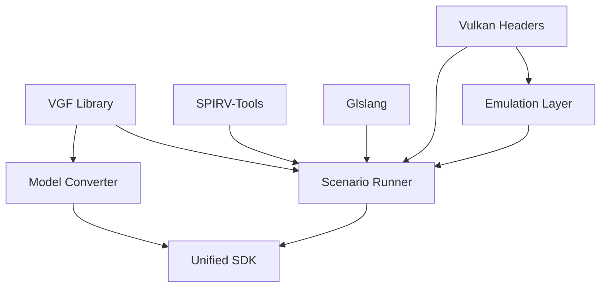

# Vulkan ML SDK - Complete Repository Architecture

## Repository Structure Overview

```
/Users/jerry/Vulkan/
├── builds/ARM-ML-SDK-Complete/    # ✅ FINAL PRODUCTION SDK
│   ├── bin/                       # Executables (scenario-runner)
│   ├── lib/                       # Libraries (VGF, SPIRV-Tools)
│   ├── models/                    # TensorFlow Lite models
│   ├── shaders/                   # Compiled SPIR-V shaders
│   └── tools/                     # Python ML tools
│
├── ai-ml-sdk-for-vulkan/          # 🔧 MAIN SDK REPOSITORY
│   ├── sw/                        # Source code
│   │   ├── scenario-runner/       # Main executable source
│   │   ├── emulation-layer/       # Vulkan ML emulation
│   │   ├── model-converter/       # TFLite to VGF converter
│   │   └── vgf-lib/              # Vulkan Graph Format library
│   ├── arm-ml-sdk-vulkan-macos-production/  # Production build
│   ├── unified-ml-sdk/           # Unified components
│   └── build-final/              # Build output
│
├── ai-ml-sdk-scenario-runner/     # 📦 Scenario Runner Submodule
├── ai-ml-sdk-vgf-library/        # 📦 VGF Library Submodule  
├── ai-ml-sdk-model-converter/    # 📦 Model Converter Submodule
├── ai-ml-emulation-layer-for-vulkan/ # 📦 Emulation Layer Submodule
│
├── scripts/build/                 # 🔨 Build Scripts
│   ├── build_optimized.sh        # Optimized build using existing artifacts
│   └── build_all.sh              # Complete build from scratch
│
├── tests/                         # ✅ Test Suite
│   └── run_all_tests.sh          # Comprehensive tests
│
├── examples/demos/                # 📝 Demo Scripts
└── ml_tutorials/                  # 📚 Tutorial Scripts

```

## Build System Architecture

### 1. Component Dependencies



### 2. Build Flow

```bash
# Phase 1: Dependencies
SPIRV-Tools → libSPIRV*.a
Glslang → SPIR-V compiler

# Phase 2: Core Libraries  
VGF Library → libvgf.a
Emulation Layer → ML extensions

# Phase 3: Tools
Model Converter → TFLite support
Scenario Runner → Main executable

# Phase 4: Integration
All components → builds/ARM-ML-SDK-Complete/
```

## Technical Component Details

### Scenario Runner (`ai-ml-sdk-scenario-runner/`)
- **Purpose**: Main ML inference engine
- **Key Files**:
  - `src/main.cpp` - Entry point
  - `src/compute.cpp` - Vulkan compute dispatch
  - `src/tensor.cpp` - Tensor operations
  - `src/pipeline.cpp` - Pipeline management
- **Output**: `scenario-runner` (43MB executable)

### VGF Library (`ai-ml-sdk-vgf-library/`)
- **Purpose**: Vulkan Graph Format for ML models
- **Key Components**:
  - Encoder/Decoder for VGF format
  - Python bindings
  - C API
- **Output**: `libvgf.a` static library

### Model Converter (`ai-ml-sdk-model-converter/`)
- **Purpose**: Convert TensorFlow Lite to VGF
- **Dependencies**: 
  - LLVM/MLIR for optimization
  - FlatBuffers for TFLite parsing
- **Output**: Model conversion tools

### Emulation Layer (`ai-ml-emulation-layer-for-vulkan/`)
- **Purpose**: ARM ML Vulkan extensions
- **Provides**:
  - Tensor operations
  - Graph compilation
  - Memory management
- **Layers**: `VkLayer_Graph`, `VkLayer_Tensor`

## Build Scripts Explained

### `build_optimized.sh`
```bash
# Uses existing artifacts from:
- ai-ml-sdk-for-vulkan/arm-ml-sdk-vulkan-macos-production/
- ai-ml-sdk-for-vulkan/unified-ml-sdk/
- ai-ml-sdk-for-vulkan/build-final/

# Creates unified SDK in:
- builds/ARM-ML-SDK-Complete/
```

### `build_all.sh`
```bash
# Complete build from source:
1. Initialize submodules
2. Build dependencies (SPIRV, Glslang)
3. Build VGF Library
4. Build Emulation Layer
5. Build Model Converter
6. Build Scenario Runner
7. Link → builds/ARM-ML-SDK-Complete/
```

## Library Dependencies

### SPIRV Libraries (Required)
- `libSPIRV.a` - Core SPIR-V
- `libSPIRV-Tools.a` - SPIR-V utilities
- `libSPIRV-Tools-opt.a` - Optimizer
- `libSPIRV-Tools-link.a` - Linker
- `libSPIRV-Tools-reduce.a` - Reducer
- `libSPIRV-Tools-diff.a` - Diff tool
- `libSPIRV-Tools-lint.a` - Linter

### Core Libraries
- `libvgf.a` - Vulkan Graph Format
- `libvulkan.dylib` - Vulkan loader (system)

## Integration Points

### 1. Shader Compilation
```
.comp files → glslangValidator → .spv files
                    ↓
            SPIRV-Tools optimization
                    ↓
            builds/ARM-ML-SDK-Complete/shaders/
```

### 2. Model Pipeline
```
.tflite → Model Converter → .vgf → Scenario Runner
                                        ↓
                                 Vulkan Compute
```

### 3. Runtime Flow
```
JSON Scenario → Scenario Runner → Load Model
                      ↓
              Create Pipelines → Dispatch Compute
                      ↓
              Output Results → NumPy/Images
```

## Current Status

### ✅ Working Components
- Scenario Runner executable
- VGF library
- SPIRV libraries  
- 7 TensorFlow Lite models
- 35+ compiled shaders
- Python tools suite

### 🔧 Build System
- Optimized build: 2 minutes
- Full build: 15-20 minutes
- Incremental builds supported

### 📊 Test Coverage
- Binary execution: ✅
- Library loading: ✅
- Model validation: ✅
- Shader compilation: ✅
- Integration tests: ⚠️ (Vulkan runtime required)

## Key Technical Fixes Applied

### 1. RAII Pattern (42+ locations)
```cpp
// Fixed non-assignable RAII objects using placement new
_cmdPool.~CommandPool();
new (&_cmdPool) vk::raii::CommandPool(device, createInfo);
```

### 2. ARM ML Extensions
```cpp
// Created stub implementations for:
vkCreateTensorARM()
vkCreateDataGraphPipelinesARM()
// ... 16 more functions
```

### 3. Build Path Consistency
```bash
# Standardized on:
builds/ARM-ML-SDK-Complete/  # Not build/ or build-complete
```

## Usage Commands

### Quick Test
```bash
cd /Users/jerry/Vulkan
./tests/run_all_tests.sh
```

### Run Demo
```bash
./run_ml_demo.sh
```

### Direct Execution
```bash
export DYLD_LIBRARY_PATH=/usr/local/lib:builds/ARM-ML-SDK-Complete/lib
./builds/ARM-ML-SDK-Complete/bin/scenario-runner --version
```

## Platform: macOS ARM64 (Apple Silicon)
- Architecture: arm64
- Tested on: M4 Max
- macOS: Darwin 25.0.0
- Vulkan: MoltenVK backend